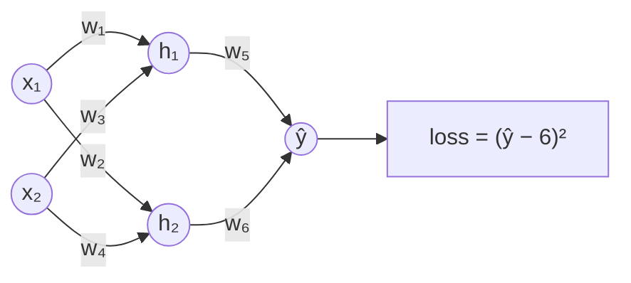

# XR Neural Net

A Unity application for Varjo mixed-reality headsets that builds a small feed-forward neural network out of 3D objects in the room. Input values and connection weights are set by hand on hand-tracked sliders (Ultraleap), and every neuron value and the loss are recomputed live. The scenes are built as small tasks, such as minimising a loss function, so the forward pass and loss minimisation can be explored by interacting with them instead of only on paper.

Developed as a student team project at the Karlsruhe Institute of Technology (KIT), 2023/24. **This repository contains my own part of the code.** See [Repository contents](#repository-contents).



*The network used in the application. The inputs x₁, x₂ and all six weights are set with hand-tracked sliders (integers from −5 to 5). Each computed neuron is the weighted sum of its inputs, e.g. h₁ = x₁·w₁ + x₂·w₃.*

## Features of the application

- **Feed-forward network in 3D:** a fully connected 2–2–1 network with two input neurons, two hidden neurons, one output neuron and six weighted edges, placed in a sci-fi styled room.
- **Hand-tracked input:** every input neuron and every edge has a 3D slider (Ultraleap Interaction Engine). Each slider position maps to an integer value from −5 to 5.
- **Live forward pass:** each hidden and output neuron shows the weighted sum of its inputs, recomputed every frame. The neurons are linear, with no bias and no activation function.
- **Loss-function task:** with a fixed target value of 6, the scene shows the squared error (ŷ − y)² live next to the MSE formula. The task is to minimise the loss by moving the sliders.
- **Randomise button:** a pressable 3D button sets all input and weight sliders to random positions.
- **Mixed reality:** the scenes use Varjo's mixed-reality component with video see-through enabled.

## Repository contents

The application was built by a team. This repository contains only what I wrote myself, so it can be published without the other authors' work:

| File | Responsibility |
|---|---|
| `Assets/SliderValueToText.cs` | Converts an Ultraleap `InteractionSlider` position to an integer from −5 to 5 and writes it to a label |
| `Assets/Calculator.cs` | Weighted sum of two neuron labels and two weight labels, written to a target label (one instance per computed neuron) |
| `Assets/Calculate_Loss_Function_Value.cs` | Squared error between the output label and the target value label |
| `Assets/RandomizeSliders.cs` | Sets all neuron and edge sliders to random positions when an `InteractionButton` is pressed |
| `Assets/Prefabs/Edge_mit_Slider.prefab` | Weight edge: graspable slider with value label |
| `Assets/LossFunction_MSE.png` | MSE formula shown in the loss-function scene |

It also contains the Unity project configuration, so the code compiles when the project is opened. The scenes, the neuron prefabs and the base framework are not included: they are joint work of the team or were provided at the start of the project.

## Tech stack

| Area | Used in the application |
|---|---|
| Engine | Unity 2021.3.15f1, High Definition Render Pipeline 12.1.8 |
| Language | C# |
| XR runtime | Varjo XR Plugin 3.3.0 (`com.varjo.xr`) |
| Hand tracking & interaction | Ultraleap Tracking 6.5.0 (hand tracking and Interaction Engine) |
| Additional XR | XR Interaction Toolkit 2.4.3 |
| Text rendering | TextMeshPro 3.0.6 |
| Hardware | Varjo headset with Ultraleap hand tracking |

## Architecture

The scripts communicate through TextMeshPro labels on the neurons and edges. Each script parses the label text of its inputs and writes its result into another label. All references are wired in the Unity Inspector.

```
InteractionSlider (0 … 1)
   │  SliderValueToText: round(v · 10) − 5
   ▼
label on input neuron / edge  (−5 … 5)
   │  Calculator: n1·w1 + n2·w2
   ▼
label on hidden neuron ──► Calculator ──► label on output neuron
                                               │  Calculate_Loss_Function_Value: (ŷ − y)²
                                               ▼
                                     "Loss function Value" panel  (y = 6)
```

In the scenes, two input neurons, two hidden neurons and one output neuron are connected by six `Edge_mit_Slider` instances. Three `Calculator` components compute the hidden and output values.

## My contributions

Within the team I worked on the interactive network scenes. Commit references point to the original team repository on KIT GitLab, which is not public.

- **Forward-pass scene:** built the network scene from the team's default scene, starting with the neuron layout (`c57d491`). Next came connection arrows with interaction and physics settings (`9438808`, `2313af9`, `8a68edc`, `1fda176`), later replaced by slider-based edges. The complete 2–2–1 network followed in `25e39ff`.
- **Slider input:** wrote `SliderValueToText.cs` (`be8defe`, `ac7fe56`), put sliders on the neurons (`fb6162b`) and added value labels to all neurons (`d6f93e4`).
- **Forward-pass computation:** wrote `Calculator.cs` (`7cf5924`), built the `Edge_mit_Slider` weight prefab (`25e39ff`) and wired both into every computed neuron.
- **Loss function:** wrote `Calculate_Loss_Function_Value.cs` and built the MSE formula panel and the loss-function scene (`0baa853`, `5e86a9a`, `697434d`).
- **Randomise button:** wrote `RandomizeSliders.cs` and built the scene variant that uses it (`6bb2068`, `3f31f78`, `c29e2d1`).
- **Integration:** merged teammates' work into my branch, removed obsolete scenes before merging (`afeb8f3`) and added the final loss-function task scene (`baf07e4`).

Teammates built the neuron prefabs, made the neurons graspable and added the neuron value display, the room design, and the XR Interaction Toolkit upgrade. The project setup and a base framework (forward pass with activation functions, backpropagation, tutorial, eye tracking) were provided at the start of the project.

## Opening the project

Requirements: Unity **2021.3.15f1**, Git on `PATH` (for the Varjo XR Plugin package), and internet access on first import (Ultraleap packages come from the OpenUPM scoped registry).

Clone the repository and open it in Unity Hub with Unity 2021.3.15f1. The first import resolves the packages from `Packages/manifest.json`. After that, the scripts compile and `Assets/Prefabs/Edge_mit_Slider.prefab` can be inspected. Running the application requires the full team project and a Varjo headset with Ultraleap hand tracking.

## Project status

The project was developed between October 2023 and January 2024. When preparing this repository, I made these fixes:

- `RandomizeSliders`: the slider clamps values to 0…1, so the previous integer values 0…9 almost always moved every slider to its maximum.
- Null checks in `SliderValueToText`, `Calculator` and `Calculate_Loss_Function_Value`, which used to throw exceptions every frame on prefabs without a slider.
- An unused component removed from the edge prefab.
- Numbers parsed and formatted independently of the system locale.

## Credits

Developed as a team project (Teamprojekt) at the Karlsruhe Institute of Technology (KIT) by a team of students.

Third-party content: a subset of the Ultraleap Tracking samples (Apache License 2.0) and the TextMesh Pro resources (Unity Companion License). See [THIRD_PARTY_NOTICES.md](THIRD_PARTY_NOTICES.md).

## License

No license is granted for the code in this repository; all rights reserved. Third-party content is covered by the licenses listed in [THIRD_PARTY_NOTICES.md](THIRD_PARTY_NOTICES.md).
